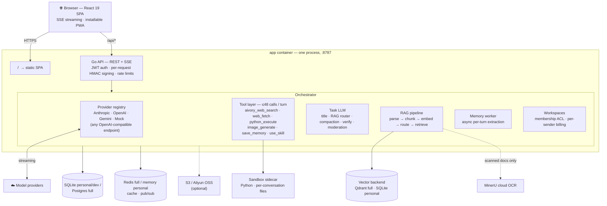

<p align="right">
  <strong>English</strong> · <a href="./README.zh-CN.md">简体中文</a>
</p>

<picture>
  <source media="(max-width: 600px)" srcset="docs/brand/readme-header-compact.svg">
  
</picture>

### Your models. Your knowledge. Your workspace.

Bring multi-model chat, research, code execution, and team collaboration together in one self-hosted platform. From a first conversation to a fully managed workspace, Aivory keeps your tools and data in one place.

<p>
  <a href="https://demo.aivorygo.com"><strong>Try the demo ↗</strong></a> &nbsp; · &nbsp;
  <a href="#quick-start"><strong>Deploy Aivory</strong></a> &nbsp; · &nbsp;
  <a href="https://docs.aivorygo.com">Documentation</a>
</p>

<p>
  <a href="./LICENSE"></a>
  <a href="https://github.com/hjxwz123/Aivory/pkgs/container/aivory-app"></a>
</p>

[Capabilities](#core-capabilities) · [Screenshots](#product-tour) · [Quick start](#quick-start) · [Architecture](#technical-architecture) · [Configuration](#configuration) · [Contributing](#contributing)

## Core capabilities

| Capability | What you can do |
| :--- | :--- |
| **Multi-model chat** | Use Claude, GPT, Gemini, image models, and OpenAI-compatible endpoints in one interface. |
| **Tools that work together** | Chain search, web fetching, Python, and file generation — up to **48 tool calls across 12 model cycles** per turn. |
| **Knowledge & documents** | Organize knowledge bases, retrieve relevant passages, and get answers with source citations. |
| **Persistent sandbox** | Analyze data and create charts, spreadsheets, and presentations in an isolated workspace for each conversation. |
| **AI presentations** | Let administrators connect Docmee's AI PPT API, set a per-deck credit price, and give signed-in users a presentation creator that also reports every generation and charge in the usage log. |
| **Team workspaces** | Share conversations, projects, files, and knowledge with your team, separate from personal data. |
| **Platform administration** | Manage providers, users, subscriptions, credits, quotas, and storage from the admin UI. |

## Product tour

<details>
<summary><strong>Explore the interface</strong> — chat, workspace overview, and administration</summary>

### A workspace for everyday AI work


### From conversation to completed work


### Everything in one admin console


</details>

## Quick start

Requires Docker 24+ with the Compose plugin.

| Deployment | Best for | Default services |
| :--- | :--- | :--- |
| [Personal](#personal-deployment) | Individual use, a smaller footprint | App + SQLite; optional sandbox |
| [Full](#full-deployment) | Teams and full infrastructure | App + PostgreSQL + Redis + Qdrant + sandbox |

See the [documentation](https://docs.aivorygo.com) for guided deployment,
upgrades, and configuration references. To explore Aivory before self-hosting,
open the [live demo](https://demo.aivorygo.com).

> **Required for domain deployments:** When using a domain or HTTPS reverse proxy, set
> `ALLOWED_ORIGINS=https://chat.example.com` in `.env` or `.env.personal`. Otherwise,
> cookie-authenticated requests may return `cross-site request blocked`. Same-origin IP/HTTP testing may leave it unset.

### Personal deployment

The personal profile keeps semantic vector retrieval but removes Postgres,
Redis, Qdrant, and the bundled sandbox containers. Business data and normalized
vectors live in one SQLite file, while cache and background work stay
in-process. Python execution remains disabled until an administrator configures
an external sandbox URL under **Admin → Tools**.

```bash
git clone https://github.com/hjxwz123/Aivory.git
cd Aivory/deploy
cp .env.personal.example .env.personal
$EDITOR .env.personal  # set JWT_SECRET; optionally configure embeddings
docker compose --env-file .env.personal -f docker-compose.personal.yml pull
docker compose --env-file .env.personal -f docker-compose.personal.yml up -d
```

The profile starts only the `app` container by default. Its bind mount defaults
to `deploy/data-personal`; the SQLite database, embedded vectors, uploads,
artifacts, and admin backups are all under that directory. It is a
single-app-instance profile and must not be horizontally scaled.

<details>
<summary>Optional: enable the Python sandbox for a personal deployment</summary>

To add the bundled Python sandbox, uncomment these matching values in
`.env.personal`:

```dotenv
SANDBOX_BASE_URL=http://sandbox:8000
SANDBOX_API_KEY=aivory-personal-sandbox
```

Then start the optional profile instead. It adds the sandbox sidecar and a
runtime-image keepalive container, and mounts the host Docker socket only into
the sidecar:

```bash
docker compose --env-file .env.personal -f docker-compose.personal.yml --profile sandbox pull
docker compose --env-file .env.personal -f docker-compose.personal.yml --profile sandbox up -d
```

</details>

### Full deployment

```bash
# 1. Clone
git clone https://github.com/hjxwz123/Aivory.git
cd Aivory/deploy

# 2. Fill in secrets
cp .env.example .env
$EDITOR .env   # set POSTGRES_PASSWORD, REDIS_PASSWORD, JWT_SECRET

# 3. Pull prebuilt images and start
docker compose -f docker-compose.prod.yml pull
docker compose -f docker-compose.prod.yml up -d
```

For a versioned deployment, edit the real `deploy/.env`, for example
`IMAGE_TAG=3.0.0` (image tags omit the Git tag's leading `v`). The app and both
sandbox images use that version automatically. Historical releases such as
`2.2.6` need the compatibility override `SANDBOX_IMAGE_TAG=latest`. Run
`docker compose --env-file .env -f docker-compose.prod.yml config --images`
before `pull` and `up -d --no-build`; see [the deployment guide](deploy/README.md#deploy-or-roll-back-by-version).

Open `http://localhost`. The setup screen appears on first launch — the first account you create becomes the administrator. Go to `/admin/channels` to add a provider key and create a model.

The full deployment starts five application services:

| Container | Image | Role |
|-----------|-------|------|
| `postgres` | `postgres:16-alpine` | Users, conversations, KBs, settings, usage |
| `redis` | `redis:7-alpine` | Cache, rate limits, kill-signal pub/sub |
| `qdrant` | `qdrant/qdrant:v1.12.4` | Vector search for RAG |
| `sandbox` | `ghcr.io/hjxwz123/aivory-sandbox-sidecar:latest` | Bundled code-execution sandbox (internal-only) |
| `app` | `ghcr.io/hjxwz123/aivory-app:latest` | One container: Go HTTP + SSE server **and** the built SPA, same origin |

<details>
<summary>Platform support and ARM64 installation notes</summary>

### x86_64 and ARM64 installation

Check the server architecture before deploying:

| `uname -m` output | Image platform | Support |
|---|---|---|
| `x86_64` / `amd64` | `linux/amd64` | Supported |
| `aarch64` / `arm64` | `linux/arm64` | Supported; requires a 64-bit Linux OS |
| `armv7l` / other 32-bit ARM | `linux/arm/v7` | Not supported |

All three Aivory images (`app`, sandbox runtime, and sandbox sidecar) publish
both supported platforms under the same tag. Compose selects the matching
variant automatically, so do not add a `platform:` override.

Existing x86_64 installations keep their current `.env`, Compose file, image
tags, volumes, and data. Upgrade with the same commands as before:

```bash
cd Aivory/deploy
docker compose --env-file .env -f docker-compose.prod.yml pull
docker compose --env-file .env -f docker-compose.prod.yml up -d --no-build
```

For a new ARM64 installation, use the normal installation commands; no ARM-only
configuration is needed:

```bash
uname -m  # must print aarch64 or arm64
git clone https://github.com/hjxwz123/Aivory.git
cd Aivory/deploy
cp .env.example .env
$EDITOR .env
docker compose --env-file .env -f docker-compose.prod.yml pull
docker compose --env-file .env -f docker-compose.prod.yml up -d
```

</details>

Postgres / Redis / Qdrant use named volumes (`pgdata`, `redisdata`, `qdrantdata`). Uploads, generated artifacts, and API-owned local objects such as avatars are bind-mounted from `DATA_DIR` (default `./data`) — files land directly on the host, no container access needed. Local objects default to `UPLOAD_DIR/object-storage`; override that path with `AIVORY_LOCAL_STORAGE_DIR` when needed. The admin backup page can also generate an async full migration ZIP that includes DB rows, files, and Qdrant vectors; completed archives live under `BACKUP_DIR` (default `DATA_DIR/backups`).

## Interleaved tools & Python sandbox

The orchestrator runs **up to 48 tool calls across 12 provider cycles in a single turn**. Tools chain freely: results from web searches, fetched pages, Python, and generated files become context for the next call without user handoffs. RAG is routed separately by the orchestrator and injected automatically when relevant.

Auto tool mode first handles explicit URLs, data attachments, named files/skills, continuations, and small tool schemas locally. Ambiguous turns use the dedicated low-latency model selected under **Admin -> Model policy** with no conversation history or tool schemas; an unset, timed-out, or invalid router fails open and sends the administrator-configured tools to the chat model.

### Multi-step pipeline in one turn

<details>
<summary>View the tool execution pipeline</summary>

<p align="center">
  
</p>

</details>

One prompt — *"Retrieve global GDP data for 2025 and generate a PowerPoint presentation"* — triggers the complete pipeline:

1. `use_skill` → load the `document-generation` skill pack
2. `aivory_web_search` → locate authoritative 2025 GDP sources (IMF / World Bank)
3. `web_fetch` → pull the numbers straight from the World Bank Open Data API
4. `python_execute` → clean the data and compute regional shares & growth
5. `python_execute` → render the charts and build a polished slide deck with python-pptx

<details>
<summary>View generated artifacts and downloads</summary>

<p align="center">
  
</p>

</details>

The result is an 8-slide deck and supporting workbook, returned as download cards alongside four charts and 20 cited sources. The model drives the workflow end to end.

### How it works

The orchestrator loops through provider cycles until the model stops emitting tool calls or the per-turn budget is reached. Within each cycle, independent tool calls run in parallel; results are fed back as a batch. Files written to `/workspace/` in one call are immediately available to the next:

```
aivory_web_search  ─┐
aivory_web_search  ─┤→ python_execute (clean data) → web_fetch → python_execute (build .pptx)
                    └─ (results merged as one batch)
```

The sandbox keeps the same filesystem session across calls and conversation turns, so later work can reuse earlier data and artifacts.

### Persistent Python sandbox

Every conversation has an isolated sandbox session. When Python is invoked, every conversation upload is staged with its original bytes in `/workspace/uploads`, including PDF, DOCX, PPTX, spreadsheets, text, code, and images. This lets the sandbox make targeted changes to an original document without first flattening its layout through text extraction. If an idle sandbox is recycled, Aivory provisions a new session, re-stages the files, and retries transparently.

- Full Python standard library + preinstalled packages (pandas, matplotlib, python-pptx, …); runner networking is always disabled
- `stdout` / `stderr` stream line-by-line while the code runs — you see progress, not just results
- Exceptions appear inline with the traceback
- Files written to `/workspace/outputs/` surface as download cards at the end of the message
- Admins can browse and clear any user's sandbox workspace from the inspector panel

### Run code in the browser too

Assistant-generated Python code blocks carry a **Run** button. Click it and Pyodide (CPython compiled to WebAssembly) executes in a Web Worker — the main thread never blocks. `matplotlib` charts render as inline PNGs; the last expression's `repr()` appears below the block.

HTML code blocks open a **live preview panel** alongside the chat as the assistant types — iframe-sandboxed, no same-origin access. Zero backend, zero cost per run.

### Available tools

| Tool | What it does |
|------|--------------|
| `aivory_web_search` | Full-text web search through Aivory via SearXNG (self-hosted) or Serper / Brave |
| `web_fetch` | Fetch and extract a URL — respects robots.txt |
| `python_execute` | Run Python in the persistent sandbox; full stdlib, packages, real file I/O |
| `image_generate` | Call a configured image model and save the result as an artifact |
| `save_memory` | Persist a user fact for injection in future conversations |
| `use_skill` | Execute an admin-defined skill (prompt + asset bundle) |

Default per-turn ceiling:

| Tool | Calls |
|------|------:|
| `aivory_web_search` | 16 |
| `web_fetch` | 12 |
| `image_generate` | 8 |
| `python_execute` | 16 |
| **All tools combined** | **48** |

### MCP services

Aivory integrates the **Model Context Protocol (Streamable HTTP transport)** — the open standard that lets assistants call external tools by capability:

- **Admin-managed catalog**: register a central MCP service once under **Admin → Capabilities & integrations → MCP services**. Name, icon, and description are public; the service URL and optional request headers (which can carry credentials such as `Authorization: Bearer …`) stay server-side and are masked after saving.
- **Per-model defaults**: a model record may pre-tick its own MCP tools (from the whole catalog). Users can still adjust tools per conversation.
- **User-managed MCP**: individual users can also add their own Streamable HTTP MCP endpoints under personal resources, independent of the admin catalog.
- **Confidence checks**: each service is tested and synchronized up front; discovered tools land in a snapshot that the model registry consumes. A service marked unavailable stays discoverable in the picker but cannot be selected — same rule as restricted internal tools.
- **Safety boundary**: MCP tool output is treated as untrusted data (never as instructions); the same cap and scoping rules that guard tool calls across the conversation apply.

For the full registration flow, transport requirements, and the auth/header rules, see [Tools, MCP, and sandbox](docs-site/docs/admin/tools-sandbox.mdx).

## RAG & knowledge bases

Knowledge bases turn uploaded files into reusable context for conversations and team workspaces. Users can organize multiple libraries, track each document from parsing through embedding, attach the right library to a chat, and let the query router choose full-document context, retrieval, or no retrieval.

- **Broad document support**: text, PDF, DOCX, PPTX, XLSX, and images, with fast local parsing for text-layer documents and optional MinerU OCR for scanned content
- **Structure-aware ingestion**: hierarchical chunks, heading breadcrumbs, overlap, and preservation of code, tables, and math blocks
- **Hybrid retrieval**: Qdrant or embedded SQLite vectors fused with relational keyword scoring, plus similarity-driven top-K
- **File routing**: a dedicated file-routing model selects the relevant uploaded files and chooses `retrieve`, `full_doc`, or `none` before context is assembled; when unset, it falls back to the general internal-task model
- **Document operations**: file status, preview, filtering, replacement, deletion, and storage through local files or S3-compatible object storage

## Team workspaces

Create an isolated workspace and invite members with a link. Conversations, projects, files, and knowledge bases are shared inside the workspace while remaining separate from every member's personal data. Messages retain author identity, each sender consumes their own allowance, and workspace owners manage membership and invitation links.

Administrators can inspect workspace membership and resources, review shared conversations, and manage the platform without joining the workspace as an ordinary member.

## Subscriptions, credits & quotas

Administrators define user tiers with visible plan descriptions, feature access, timed allowances, permanent credit pools, and per-model count or cost limits. Users can compare available plans, inspect balances and usage, redeem codes, and purchase configured credit packages.

Payment checkout is optional and operator-configured. Aivory supports multiple payment channels and methods, auditable payment orders, webhook processing, and reconciliation without coupling the rest of the platform to a payment provider.

## Full admin backend

| Area | What administrators manage |
|------|----------------------------|
| Providers & models | Channel URLs and keys, model availability, pricing, context windows, model controls, tags, fallbacks, and tool capability policies |
| Tools & knowledge | Built-in and official tools, RAG settings, document libraries, embedding state, image styles, skills, and prompt templates |
| Users & workspaces | Roles, user groups, quotas, login history, moderation, memories, files, shared workspaces, and read-only conversation inspection |
| Sign-in & SSO | Email/password on/off, registration policy, captcha, **OAuth/OIDC** (Google · GitHub · Apple · generic OIDC/OAuth2 — Azure AD/Okta/Keycloak via generic OIDC), TOTP 2FA, session revocation |
| Subscriptions & payments | Public plans, timed and permanent credits, model quotas, credit packages, redeem codes, payment channels and methods, order audit, and reconciliation |
| Usage & operations | Per-user/model/purpose analytics, cost reports, announcements, email, OAuth, registration, legal content, logging, and model feedback |
| Infrastructure | Sandbox, object storage, SearXNG, MinerU, upload policy, backup and migration, and live system settings |

Most runtime configuration takes effect on the next request, without editing environment files or restarting the application.

## Additional capabilities

| Capability | Summary |
|------------|---------|
| Conversation branches | Edit or regenerate without overwriting history, switch between sibling answers, and navigate long conversations from an outline |
| Deep Research & Verify | Run multi-step cited research when needed, or ask a second configured model to audit an answer |
| Memory | Extract and reuse durable user preferences across personal conversations, with user controls and workspace privacy isolation |
| Image generation | Generate or edit images with model-specific controls, curated styles, usage metering, and a personal gallery |
| Projects, skills & prompts | Group conversations and files under project instructions; install administrator resources or create personal reusable skills and prompts |
| Experience & security | Streaming reasoning, long-context compaction, sharing, PWA, five languages, responsive themes, backend-only keys, HMAC signing, upload validation, and rate limits |
| MCP tool integration | Open, standard tool access via Streamable HTTP MCP — admin catalog + per-model defaults + user-managed endpoints |
| Enterprise SSO | Google · GitHub · Apple · generic OIDC / OAuth2 (Azure AD, Okta, Keycloak, …), auto-provisioning, TOTP 2FA, session revocation |

## Enterprise sign-in (SSO)

Bring your own identity provider and keep password logins behind it. Aivory authenticates enterprise users through standards-based OAuth/OIDC instead of storing corporate passwords:

- **Five provider modes**: Google, GitHub, Apple, **generic OAuth 2.0** (UserInfo), and **generic OpenID Connect** (ID-token signature validation via JWKS). Any IdP that speaks OIDC or OAuth 2 — Azure AD / Entra ID, Okta, Keycloak, Auth0, GitLab, Feishu/Lark, or a self-hosted IdP — connects through the generic kinds by entering its authorize, token, userinfo/issuer and JWKS endpoints.
- **Enterprise SSO posture**: disable email/password registration and site password sign-in, keep only the OIDC/OAuth2 sources, and set the unauthenticated entry point to auto-redirect to the default provider. Identity link (binding) is hardened with subject-keying so re-login matches the provider's immutable subject, never the user-supplied email; a state nonce + PKCE keeps the callback from being replayable.
- **Provisioning & lifecycle**: third-party sign-in may auto-provision accounts; the initial-password policy can still require a first password for OAuth-created users. Administrators can bind/unbind identities, rotate credentials, and revoke sessions centrally.
- **Security defaults**: OAuth client secrets and Apple `.p8` keys stay server-side; token exchange has a bounded timeout with clear egress diagnostics; per-IP rate limits cover the OAuth endpoints; access-token expiry, TOTP 2FA, and login audit rows apply to SSO sessions just like password sessions.

LDAP / AD directory sync is **not** yet offered — SSO at this layer is delegated to your IdP through OIDC/OAuth 2. The full provider matrix, safe-launch checklist, and the enterprise lockdown recipe live in [Login methods & SSO](docs-site/docs/admin/access-auth.mdx).

## Compile and run locally (development)

The local build needs no Docker, Postgres, Redis, or Qdrant. Build the SPA into
`dist/`, then let the Go API use SQLite and in-memory cache while serving both
the SPA and `/api` on port 8787 through `STATIC_DIR`.

```bash
# Build the frontend from the repository root.
npm ci
npm run build

# Build and run the backend; keep server/ as the working directory.
cd server
go build -o aivory ./cmd/api
STATIC_DIR=../dist ./aivory
```

Open `http://localhost:8787`. Without `JWT_SECRET`, local development generates
a random key at each start, so existing login sessions expire after a restart.
Data defaults to `server/data/`; the first account created on an empty database
becomes the administrator.

## Technical architecture

<details>
<summary>View the architecture overview poster</summary>


</details>



> Everything admin-configurable hot-reloads — providers, models, tools, RAG, storage — no restarts.

## Configuration

Most of Aivory is configured from the admin UI at runtime — provider keys, MinerU token, S3 credentials, SearXNG URL, upload allowlist, disabled tools, compaction settings. All apply on the next request, no restart needed.

The optional **AI PPT** workbench is configured in **Admin → Credits and quotas → AI PPT (Docmee)**. Once an administrator saves a Docmee API key and enables the integration, signed-in users see **AI PPT** in the sidebar; until then the entry stays hidden and the `/ppt` page cannot start a generation. Generations are billed per deck through the same credit system as chat, and every generation (and every charged edit) is reported in **Admin → Usage & billing**. See the [AI PPT integration guide](docs/ai-ppt-docmee.md) for the credit lifecycle, template management and operating details.

The env file only holds boot-time essentials:

| Group | Keys | Purpose |
|-------|------|---------|
| **Image** | `IMAGE_OWNER`, `IMAGE_TAG`, `SANDBOX_IMAGE_TAG` | GHCR namespace, shared release version, and optional historical sandbox override |
| **Network** | `ALLOWED_ORIGINS` | Required for a domain or HTTPS reverse proxy; exact browser origin(s), without paths. Same-origin IP/HTTP testing may leave it unset. |
| **Postgres** | `POSTGRES_USER/PASSWORD/DB` | Database credentials |
| **Redis** | `REDIS_PASSWORD` | Cache auth |
| **Auth** | `JWT_SECRET` | Required; ≥ 32 chars |
| **Data** | `DATA_DIR`, `BACKUP_DIR`, `MAX_BACKUP_BYTES` | Host directory for uploads/artifacts, async admin backup archives, and import size cap |
| **Sandbox** | `SANDBOX_BASE_URL`, `SANDBOX_API_KEY` | Python sandbox sidecar (optional) |
| **Boot fallbacks** | `SEARCH_*`, `EMBEDDING_*`, `MINERU_*` | Used when the matching admin setting is absent |

### Advanced tuning (optional)

Beyond the boot-time keys above, every internal timeout, concurrency limit, retry/backoff, batch size, cache TTL, and similar tuning knob is also overridable via environment variable — see **[`docs/config-reference.md`](docs/config-reference.md)** (Chinese: [`docs/config-reference.zh-CN.md`](docs/config-reference.zh-CN.md)) for the full list with defaults and locations.

These are intentionally **not** listed in `.env.example` — leave it alone unless you actually need one. Every variable defaults to the current hardcoded value, so Aivory's behavior is unchanged if you set none of them. If you need one, copy it from the reference doc into your own `.env`:

- Backend (Go) vars take effect on the next `aivory-api` restart.
- `VITE_*` frontend vars are inlined at **build time** — set them before `npm run build` / the frontend Docker build, not at container runtime.
- `SANDBOX_*` vars belong to the `sandbox-service` process and take effect on its restart.

## Tech stack

- **Frontend**: React 19, TypeScript 5, Vite 6, Tailwind 4, Radix UI, Zustand, i18next, lucide-react
- **Backend**: Go 1.22, standard `net/http`, hand-rolled typed queries
- **Storage**: PostgreSQL 16 (full deployment) / SQLite (personal and local)
- **Cache & coordination**: Redis 7
- **Vector search**: Qdrant 1.12 (full deployment) / embedded SQLite exact cosine search (personal)
- **Document parsing**: MinerU cloud API (PDF / DOCX / PPTX / images via OCR)
- **Internationalization**: 5 locales — English, Simplified Chinese, Traditional Chinese, Japanese, French

## Project layout

```
.
├── src/                      React SPA
│   ├── pages/                chat · admin · kb · memory · projects · settings
│   ├── components/           chat primitives, UI system, sidebar
│   ├── store/                Zustand stores (conversations, models, UI, …)
│   └── styles/               Tailwind tokens + global CSS
├── server/                   Go API
│   ├── cmd/api/              main entrypoint
│   └── internal/
│       ├── api/              HTTP handlers, router, upload safety
│       ├── llm/              Provider adapters + orchestrator + task LLM + memory worker
│       ├── tools/            All 8 built-in tools
│       ├── rag/              parse → chunk → embed → query-route → retrieve
│       ├── vector/           Qdrant and embedded SQLite vector backends
│       ├── store/            Schema + typed queries (SQLite / PostgreSQL)
│       ├── sandbox/          HTTP client for the Python sandbox sidecar
│       └── storage/          S3 / OSS presign client
├── deploy/                   Docker deployment profiles
│   ├── docker-compose.prod.yml
│   ├── docker-compose.personal.yml
│   ├── .env.example
│   └── .env.personal.example
└── docs/screenshots/         Screenshots referenced in this README
```

## Contributing

Open an issue first for non-trivial changes. Before submitting a PR:

```bash
# Frontend
npm run lint && npm run typecheck && npm run build

# Backend
cd server && go vet ./... && go build ./...
```

## License

[Apache 2.0](./LICENSE) — you may use, modify, and distribute this software, including in proprietary/closed-source products, provided you retain the original copyright notice, include a copy of this license, and note any modifications you make.

## Acknowledgements

[Qdrant](https://qdrant.tech/) · [Radix UI](https://www.radix-ui.com/) · [Linux Do](https://linux.do/)
