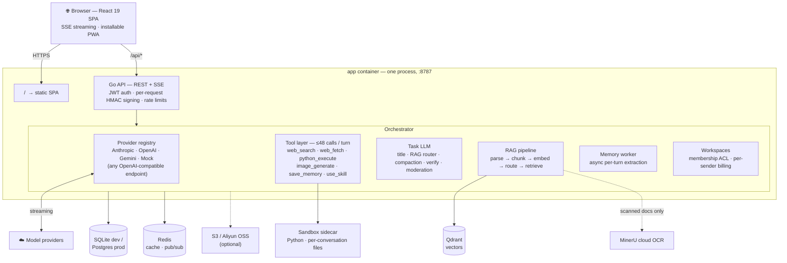

# Aivory

<p align="center">
  
</p>

<p align="center">
  <strong>A production-ready, self-hosted multi-model AI platform for individuals and teams.</strong><br>
  Interleaved tool calls · RAG & knowledge bases · Persistent sandbox · Team workspaces · Subscriptions · Full admin backend.
</p>

<p align="center">
  <a href="./README.md"><strong>English</strong></a> ·
  <a href="./README.zh-CN.md">简体中文</a>
</p>

<p align="center">
  <a href="https://github.com/hjxwz123/Aivory/actions/workflows/docker-images.yml"></a>
  <a href="https://github.com/hjxwz123/Aivory/pkgs/container/aivory-app"></a>
  
  
  
  <a href="./LICENSE"></a>
</p>

<p align="center">
  
</p>

---

## A complete AI workspace

Most self-hosted AI frontends stop at forwarding messages to a model. Aivory combines multi-model chat, autonomous tool execution, document intelligence, isolated computation, team collaboration, subscriptions, and day-to-day operations in one deployable platform.

<p align="center">
  
</p>

## Core capabilities

| | Feature | What you get |
|---|---|---|
| 🔀 | **Multi-model AI chat** | Claude, GPT, Gemini, image models, and any OpenAI-compatible endpoint behind one consistent UI, with per-message model attribution and admin-defined model controls |
| 🛠 | **Interleaved tool calls** | Up to **48 tool calls across 12 provider cycles in one turn**; search, fetch, Python, files, memory, and image tools can form one autonomous workflow |
| 📚 | **RAG & knowledge bases** | Managed document libraries, query routing, structure-aware chunking, hybrid retrieval with RRF, dynamic top-K, full-document fallback, and cited answers |
| 🐍 | **Persistent Python sandbox** | Isolated, per-conversation workspaces for data analysis and file generation; eligible uploads are staged in and generated artifacts stream back to the chat |
| 👥 | **Team workspaces** | Isolated shared conversations, projects, files, and knowledge bases with invite links, member attribution, owner controls, and admin oversight |
| 💳 | **Subscriptions & quotas** | User tiers, timed allowances, permanent credits, per-model limits, redeem codes, credit packages, and optional payment checkout |
| 🛡 | **Full admin backend** | Operate providers, models, tools, users, workspaces, knowledge, subscriptions, payments, storage, usage, security, backups, and system settings without editing config files |

---

## Interleaved tools & Python sandbox

The orchestrator runs **up to 48 tool calls across 12 provider cycles in a single turn**. Tools chain freely: results from web searches, fetched pages, Python, and generated files become context for the next call without user handoffs. RAG is routed separately by the orchestrator and injected automatically when relevant.

### Multi-step pipeline in one turn

<p align="center">
  
</p>

One prompt — *"Retrieve global GDP data for 2025 and generate a PowerPoint presentation"* — triggers the complete pipeline:

1. `use_skill` → load the `document-generation` skill pack
2. `web_search` → locate authoritative 2025 GDP sources (IMF / World Bank)
3. `web_fetch` → pull the numbers straight from the World Bank Open Data API
4. `python_execute` → clean the data and compute regional shares & growth
5. `python_execute` → render the charts and build a polished slide deck with python-pptx

<p align="center">
  
</p>

The result is an 8-slide deck and supporting workbook, returned as download cards alongside four charts and 20 cited sources. The model drives the workflow end to end.

### How it works

The orchestrator loops through provider cycles until the model stops emitting tool calls or the per-turn budget is reached. Within each cycle, independent tool calls run in parallel; results are fed back as a batch. Files written to `/workspace/` in one call are immediately available to the next:

```
web_search  ─┐
web_search  ─┤→ python_execute (clean data) → web_fetch → python_execute (build .pptx)
             └─ (results merged as one batch)
```

The sandbox keeps the same filesystem session across calls and conversation turns, so later work can reuse earlier data and artifacts.

### Persistent Python sandbox

Every conversation has an isolated sandbox session. If an idle sandbox is recycled, Aivory provisions a new session, re-stages eligible files, and retries transparently. CSV, spreadsheets, text, and code may enter `/workspace/uploads`; user and generated images never enter the sandbox and are sent only through a vision model's native multimodal API.

- Full Python standard library + preinstalled packages (pandas, matplotlib, python-pptx, …); runner networking is always disabled
- `stdout` / `stderr` stream line-by-line while the code runs — you see progress, not just results
- Exceptions appear inline with the traceback
- Files written to `/workspace/outputs/` surface as download cards at the end of the message
- Admins can browse and clear any user's sandbox workspace from the inspector panel

### Run code in the browser too

Assistant-generated Python code blocks carry a **Run** button. Click it and Pyodide (CPython compiled to WebAssembly) executes in a Web Worker — the main thread never blocks. `matplotlib` charts render as inline PNGs; the last expression's `repr()` appears below the block.

HTML code blocks open a **live preview panel** alongside the chat as the assistant types — iframe-sandboxed, no same-origin access. Zero backend, zero cost per run.

### Available tools

| Tool | What it does |
|------|--------------|
| `web_search` | Full-text web search via SearXNG (self-hosted) or Serper / Brave |
| `web_fetch` | Fetch and extract a URL — respects robots.txt |
| `python_execute` | Run Python in the persistent sandbox; full stdlib, packages, real file I/O |
| `image_generate` | Call a configured image model and save the result as an artifact |
| `save_memory` | Persist a user fact for injection in future conversations |
| `use_skill` | Execute an admin-defined skill (prompt + asset bundle) |

Default per-turn ceiling:

| Tool | Calls |
|------|------:|
| `web_search` | 16 |
| `web_fetch` | 12 |
| `image_generate` | 8 |
| `python_execute` | 16 |
| **All tools combined** | **48** |

---

## RAG & knowledge bases

Knowledge bases turn uploaded files into reusable context for conversations and team workspaces. Users can organize multiple libraries, track each document from parsing through embedding, attach the right library to a chat, and let the query router choose full-document context, retrieval, or no retrieval.

- **Broad document support**: text, PDF, DOCX, PPTX, XLSX, and images, with fast local parsing for text-layer documents and optional MinerU OCR for scanned content
- **Structure-aware ingestion**: hierarchical chunks, heading breadcrumbs, overlap, and preservation of code, tables, and math blocks
- **Hybrid retrieval**: Qdrant vectors and PostgreSQL BM25 fused with Reciprocal Rank Fusion, plus similarity-driven top-K
- **Query routing**: a task model selects `retrieve`, `full_doc`, or `none` before context is assembled
- **Document operations**: file status, preview, filtering, replacement, deletion, and storage through local files or S3-compatible object storage

---

## Team workspaces

Create an isolated workspace and invite members with a link. Conversations, projects, files, and knowledge bases are shared inside the workspace while remaining separate from every member's personal data. Messages retain author identity, each sender consumes their own allowance, and workspace owners manage membership and invitation links.

Administrators can inspect workspace membership and resources, review shared conversations, and manage the platform without joining the workspace as an ordinary member.

---

## Subscriptions, credits & quotas

Administrators define user tiers with visible plan descriptions, feature access, timed allowances, permanent credit pools, and per-model count or cost limits. Users can compare available plans, inspect balances and usage, redeem codes, and purchase configured credit packages.

Payment checkout is optional and operator-configured. Aivory supports multiple payment channels and methods, auditable payment orders, webhook processing, and reconciliation without coupling the rest of the platform to a payment provider.

---

## Full admin backend

<p align="center">
  
</p>

| Area | What administrators manage |
|------|----------------------------|
| Providers & models | Channel URLs and keys, model availability, pricing, context windows, model controls, tags, fallbacks, and tool capability policies |
| Tools & knowledge | Built-in and official tools, RAG settings, document libraries, embedding state, image styles, skills, and prompt templates |
| Users & workspaces | Roles, user groups, quotas, login history, moderation, memories, files, shared workspaces, and read-only conversation inspection |
| Subscriptions & payments | Public plans, timed and permanent credits, model quotas, credit packages, redeem codes, payment channels and methods, order audit, and reconciliation |
| Usage & operations | Per-user/model/purpose analytics, cost reports, announcements, email, OAuth, registration, legal content, logging, and model feedback |
| Infrastructure | Sandbox, object storage, SearXNG, MinerU, upload policy, backup and migration, and live system settings |

Most runtime configuration takes effect on the next request, without editing environment files or restarting the application.

---

## Additional capabilities

| Capability | Summary |
|------------|---------|
| Conversation branches | Edit or regenerate without overwriting history, switch between sibling answers, and navigate long conversations from an outline |
| Deep Research & Verify | Run multi-step cited research when needed, or ask a second configured model to audit an answer |
| Memory | Extract and reuse durable user preferences across personal conversations, with user controls and workspace privacy isolation |
| Image generation | Generate or edit images with model-specific controls, curated styles, usage metering, and a personal gallery |
| Projects, skills & prompts | Group conversations and files under project instructions; install administrator resources or create personal reusable skills and prompts |
| Experience & security | Streaming reasoning, long-context compaction, sharing, PWA, five languages, responsive themes, backend-only keys, HMAC signing, upload validation, and rate limits |

---

## Quick start

Requires Docker 24+ with the Compose plugin.

```bash
# 1. Clone
git clone https://github.com/hjxwz123/Aivory.git
cd Aivory/deploy

# 2. Fill in secrets
cp .env.example .env
$EDITOR .env   # set POSTGRES_PASSWORD, REDIS_PASSWORD, JWT_SECRET

# 3. Pull prebuilt images and start
docker compose -f docker-compose.prod.yml pull
docker compose -f docker-compose.prod.yml up -d
```

Open `http://localhost`. The setup screen appears on first launch — the first account you create becomes the administrator. Go to `/admin/channels` to add a provider key and create a model.

Five containers come up:

| Container | Image | Role |
|-----------|-------|------|
| `postgres` | `postgres:16-alpine` | Users, conversations, KBs, settings, usage |
| `redis` | `redis:7-alpine` | Cache, rate limits, kill-signal pub/sub |
| `qdrant` | `qdrant/qdrant:v1.12.4` | Vector search for RAG |
| `sandbox` | `ghcr.io/hjxwz123/aivory-sandbox-sidecar:latest` | Bundled code-execution sandbox (internal-only) |
| `app` | `ghcr.io/hjxwz123/aivory-app:latest` | One container: Go HTTP + SSE server **and** the built SPA, same origin |

Postgres / Redis / Qdrant use named volumes (`pgdata`, `redisdata`, `qdrantdata`). Uploads, generated artifacts, and API-owned local objects such as avatars are bind-mounted from `DATA_DIR` (default `./data`) — files land directly on the host, no container access needed. Local objects default to `UPLOAD_DIR/object-storage`; override that path with `AIVORY_LOCAL_STORAGE_DIR` when needed. The admin backup page can also generate an async full migration ZIP that includes DB rows, files, and Qdrant vectors; completed archives live under `BACKUP_DIR` (default `DATA_DIR/backups`).

---

## Local development

The Go API ships with an embedded SQLite driver and a full-context RAG fallback, so everything runs without external services for development. Docker Compose still starts Qdrant by default for production-like vector retrieval.

```bash
# Backend
cd server
go run ./cmd/api          # listens on :8787

# Frontend (separate terminal)
cd ..
npm install
npm run dev               # Vite at :5173, proxies /api to :8787
```

Open `http://localhost:5173`. First launch shows the setup screen.

---

## Technical architecture



> Everything admin-configurable hot-reloads — providers, models, tools, RAG, storage — no restarts.


---

## Configuration

Most of Aivory is configured from the admin UI at runtime — provider keys, MinerU token, S3 credentials, SearXNG URL, upload allowlist, disabled tools, compaction settings. All apply on the next request, no restart needed.

The env file only holds boot-time essentials:

| Group | Keys | Purpose |
|-------|------|---------|
| **Image** | `IMAGE_OWNER`, `IMAGE_TAG` | GHCR namespace / tag to pull |
| **Network** | *(none)* | App serves SPA + `/api` on one origin; host port is the `80:8787` mapping in compose. No domain/CORS env. |
| **Postgres** | `POSTGRES_USER/PASSWORD/DB` | Database credentials |
| **Redis** | `REDIS_PASSWORD` | Cache auth |
| **Auth** | `JWT_SECRET` | Required; ≥ 32 chars |
| **Data** | `DATA_DIR`, `BACKUP_DIR`, `MAX_BACKUP_BYTES` | Host directory for uploads/artifacts, async admin backup archives, and import size cap |
| **Sandbox** | `SANDBOX_BASE_URL`, `SANDBOX_API_KEY` | Python sandbox sidecar (optional) |
| **Boot fallbacks** | `SEARCH_*`, `EMBEDDING_*`, `MINERU_*` | Used when the matching admin setting is absent |

### Advanced tuning (optional)

Beyond the boot-time keys above, every internal timeout, concurrency limit, retry/backoff, batch size, cache TTL, and similar tuning knob is also overridable via environment variable — see **[`docs/config-reference.md`](docs/config-reference.md)** (Chinese: [`docs/config-reference.zh-CN.md`](docs/config-reference.zh-CN.md)) for the full list with defaults and locations.

These are intentionally **not** listed in `.env.example` — leave it alone unless you actually need one. Every variable defaults to the current hardcoded value, so Aivory's behavior is unchanged if you set none of them. If you need one, copy it from the reference doc into your own `.env`:

- Backend (Go) vars take effect on the next `aivory-api` restart.
- `VITE_*` frontend vars are inlined at **build time** — set them before `npm run build` / the frontend Docker build, not at container runtime.
- `SANDBOX_*` vars belong to the `sandbox-service` process and take effect on its restart.

---

## Tech stack

- **Frontend**: React 19, TypeScript 5, Vite 5, Tailwind 4, Radix UI, Zustand, i18next, lucide-react
- **Backend**: Go 1.22, standard `net/http`, hand-rolled typed queries
- **Storage**: PostgreSQL 16 (production) / SQLite (embedded dev fallback)
- **Cache & coordination**: Redis 7
- **Vector search**: Qdrant 1.12 (full-context fallback when no vector backend is configured)
- **Document parsing**: MinerU cloud API (PDF / DOCX / PPTX / images via OCR)
- **Internationalization**: 5 locales — English, Simplified Chinese, Traditional Chinese, Japanese, French

---

## Project layout

```
.
├── src/                      React SPA
│   ├── pages/                chat · admin · kb · memory · projects · settings
│   ├── components/           chat primitives, UI system, sidebar
│   ├── store/                Zustand stores (conversations, models, UI, …)
│   └── styles/               Tailwind tokens + global CSS
├── server/                   Go API
│   ├── cmd/api/              main entrypoint
│   └── internal/
│       ├── api/              HTTP handlers, router, upload safety
│       ├── llm/              Provider adapters + orchestrator + task LLM + memory worker
│       ├── tools/            All 8 built-in tools
│       ├── rag/              parse → chunk → embed → query-route → retrieve
│       ├── vector/           Qdrant client (+ PG fallback)
│       ├── store/            Schema + typed queries (SQLite / PostgreSQL)
│       ├── sandbox/          HTTP client for the Python sandbox sidecar
│       └── storage/          S3 / OSS presign client
├── deploy/                   Production Docker stack
│   ├── docker-compose.prod.yml
│   ├── Dockerfile.app          Multi-stage: SPA build + Go build → one runtime
│   └── .env.example
└── docs/screenshots/         Screenshots referenced in this README
```

---

## GitHub Actions

| Workflow | Trigger | Output |
|----------|---------|--------|
| `docker-images.yml` | push to `main`, `v*.*.*` tags, manual dispatch | `ghcr.io/<owner>/aivory-app` — multi-arch (amd64 + arm64) |

- `main` → `:latest` + `:sha-<short>`
- `v1.2.3` → `:1.2.3` + `:1.2` + `:1` + `:latest`

The workflow only needs `GITHUB_TOKEN`.

---

## Contributing

Open an issue first for non-trivial changes. Before submitting a PR:

```bash
# Frontend
npm run lint && npm run typecheck && npm run build

# Backend
cd server && go vet ./... && go build ./...
```

---

## License

[Apache 2.0](./LICENSE) — you may use, modify, and distribute this software, including in proprietary/closed-source products, provided you retain the original copyright notice, include a copy of this license, and note any modifications you make.

---

## Acknowledgements

[MinerU](https://mineru.net) · [Qdrant](https://qdrant.tech) · [SearXNG](https://github.com/searxng/searxng) · [Radix UI](https://www.radix-ui.com)
