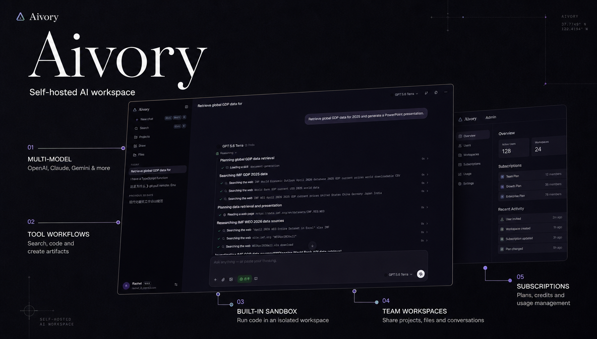
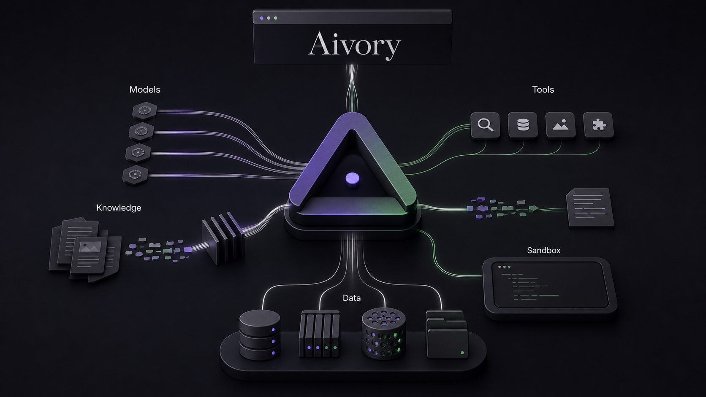
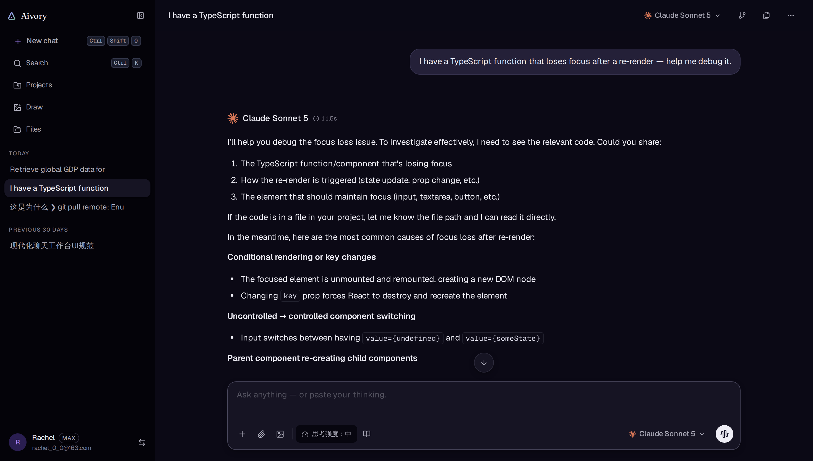
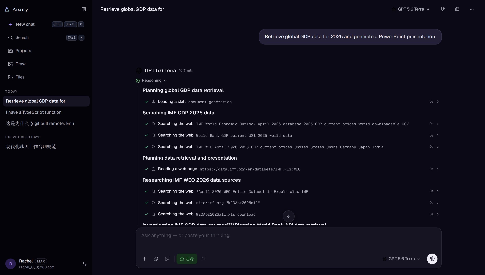
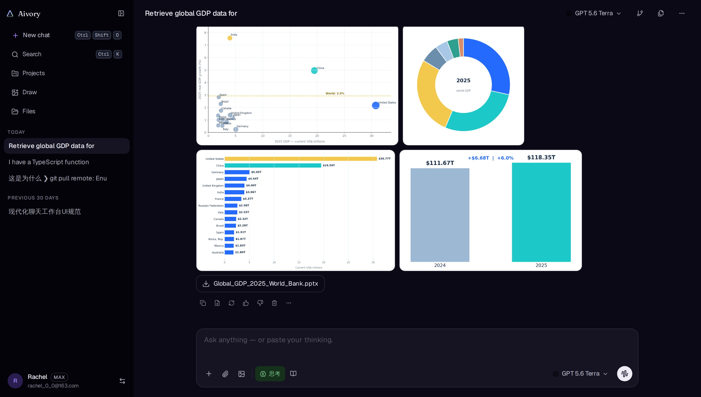
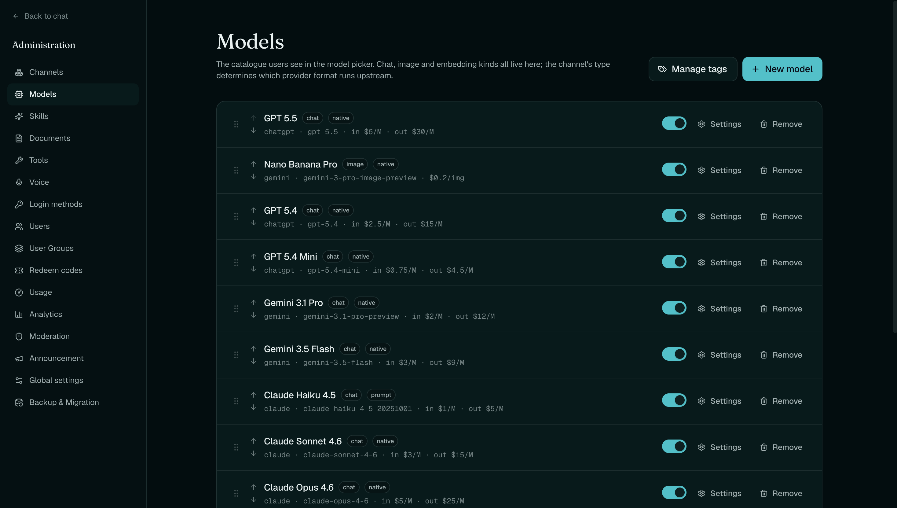
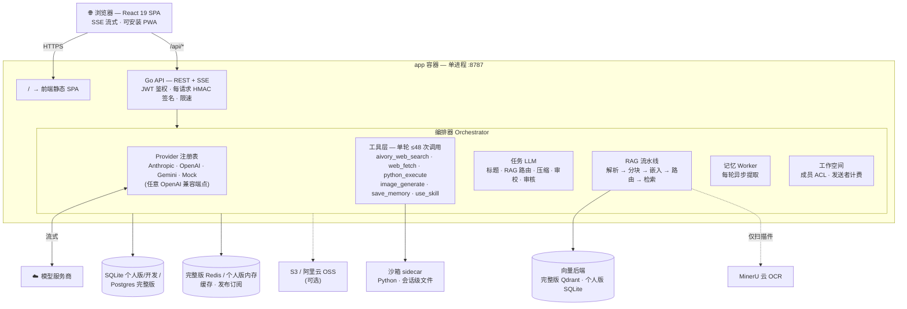

# Aivory

<p align="center">
  
</p>

> 面向个人与团队的生产级自部署多模型 AI 平台：多轮工具调用、RAG 与知识库、持久沙箱、团队工作空间、订阅体系和完整管理后台，一套系统即可运行。

<p align="center">
  <a href="./README.md">English</a> ·
  <a href="./README.zh-CN.md"><strong>简体中文</strong></a>
</p>

<p align="center">
  <a href="https://docs.aivorygo.com"><strong>使用文档</strong></a> ·
  <a href="https://demo.aivorygo.com"><strong>在线体验</strong></a>
</p>

<p align="center">
  <a href="https://github.com/hjxwz123/Aivory/pkgs/container/aivory-app"></a>
  
  
  
  <a href="./LICENSE"></a>
</p>

<p align="center">
  
</p>

---

## 一套完整的 AI 工作空间

大多数自部署 AI 前端只负责把消息转发给模型。Aivory 将多模型对话、自主工具执行、文档智能、隔离计算、团队协作、订阅体系和日常运营整合为一个可直接部署的平台。

<p align="center">
  
</p>

## 核心能力

| | 功能 | 你能得到什么 |
|---|---|---|
| 🔀 | **多模型 AI 对话** | 在同一套 UI 中使用 Claude、GPT、Gemini、图片模型和任意 OpenAI 兼容端点，按消息记录模型，并由管理员配置模型控件和能力 |
| 🛠 | **多轮工具调用** | 单轮最多 **48 次工具调用、12 个模型循环**；搜索、抓取、Python、文件、记忆和图片工具可组成一条自主工作流 |
| 📚 | **RAG 与知识库** | 文档库管理、查询路由、结构感知分块、混合检索与 RRF、动态 Top-K、全文兜底和带引用回答 |
| 🐍 | **持久 Python 沙箱** | 每个对话拥有隔离的持久工作区，可分析数据、生成文件、暂存合规输入，并将图表和文档等产物流式返回对话 |
| 👥 | **团队工作空间** | 隔离共享对话、项目、文件和知识库，支持邀请链接、成员署名、空间所有者管理和管理员审查 |
| 💳 | **订阅与配额** | 用户层级、定时额度、永久积分、按模型限制、兑换码、积分套餐和可选支付结算 |
| 🛡 | **完整管理后台** | 集中管理渠道、模型、工具、用户、工作空间、知识库、订阅、支付、存储、用量、安全、备份和系统设置 |

---

## 多轮工具调用与 Python 沙箱

编排器在一次对话中最多执行 **48 次工具调用，跨越 12 个模型循环**。网络搜索、网页内容、Python 结果和生成文件都可以成为下一次调用的输入，无需用户在中间手动接力。RAG 由编排器单独路由，并在相关时自动注入知识库内容。

自动工具模式会先在本地处理明确 URL、数据附件、指定文件或技能、工具调用续问以及较小的工具声明。其余模糊请求才会交给管理员在**模型策略**中指定的专用低延迟模型，且不携带对话历史和工具 schema；未配置专用模型时使用当前对话模型，超时或输出无效时按 fail-open 规则把管理员配置的工具交给对话模型判断。

### 单次提问完成完整任务

<p align="center">
  
</p>

例如，一条“检索 2025 年全球 GDP 数据并制作 PowerPoint”的消息可以自动完成：

1. `use_skill`：加载文档生成技能
2. `aivory_web_search`：定位 IMF、世界银行等权威来源
3. `web_fetch`：获取原始数据
4. `python_execute`：清洗数据并计算指标
5. `python_execute`：绘制图表并生成演示文稿

<p align="center">
  
</p>

最终得到可下载的演示文稿与数据表、内联图表和引用来源，整条流程由模型端到端驱动。

### 持久 Python 沙箱

每个对话拥有独立沙箱会话。调用 Python 时，对话上传的全部文件都会以原始字节暂存到 `/workspace/uploads`，包括 PDF、DOCX、PPTX、表格、文本、代码和图片，因此可以直接修改原文档并保留既有排版，而不必先提取文本再重建。文件可跨工具调用和多轮对话复用；空闲沙箱被回收后，Aivory 会自动创建新会话、重新暂存文件并透明重试。

- 完整 Python 标准库和预装依赖，包括 pandas、matplotlib、python-pptx 等；运行器始终关闭网络
- `stdout`、`stderr` 和异常信息实时流式返回
- 写入 `/workspace/outputs/` 的图表、表格和文档自动显示为下载卡片
- 管理员可通过沙箱检查器浏览和清理用户工作区
- Python 代码块也可通过 Pyodide 在浏览器 Web Worker 中直接运行

### 可用工具

| 工具 | 功能 |
|------|------|
| `aivory_web_search` | 通过 Aivory 配置的 SearXNG（自部署）、Serper 或 Brave 后端进行全文网络搜索。 |
| `web_fetch` | 抓取指定 URL 并提取正文，遵守 robots.txt 与内容安全过滤。 |
| `python_execute` | 在无网络的隔离沙箱中运行 Python 代码。支持完整标准库、预装依赖和文件 I/O。 |
| `image_generate` | 调用配置的图像模型（Gemini Imagen、OpenAI DALL-E 等）生成图片并保存为产物。 |
| `save_memory` | 把一条事实写入用户记忆库，后续对话会自动注入。 |
| `use_skill` | 执行管理员预定义的技能（提示词模板 + 资产包）。 |

默认单轮调用上限：

| 工具 | 次数 |
|------|-----:|
| `aivory_web_search` | 16 |
| `web_fetch` | 12 |
| `image_generate` | 8 |
| `python_execute` | 16 |
| **全部工具合计** | **48** |

---

## RAG 与知识库

知识库将上传文件转化为可以在个人对话和团队工作空间中重复使用的上下文。用户可以创建多个文档库、跟踪解析与嵌入状态、为对话挂载知识库，并由查询路由自动选择全文、检索或跳过 RAG。

- **广泛的文档支持**：文本、PDF、DOCX、PPTX、XLSX 和图片；文字层文档优先本地快速解析，扫描件可选 MinerU OCR
- **结构感知入库**：层级分块、标题路径、合理重叠，并完整保留代码、表格和数学公式
- **混合检索**：Qdrant 或 SQLite 内嵌向量与关系型关键词评分通过 RRF 融合，并按相似度动态决定 Top-K
- **文件路由**：专用文件路由模型在拼装上下文前选择相关上传文件，并决定 `retrieve`、`full_doc` 或 `none`；未配置时回退到其他内部任务模型
- **完整文档管理**：状态跟踪、预览、筛选、替换、删除，以及本地文件或 S3 兼容对象存储

---

## 团队工作空间

创建隔离工作空间并通过链接邀请成员。空间内共享对话、项目、文件和知识库，同时与每个成员的个人数据完全分离。消息保留发送者身份，各成员使用自己的额度，空间所有者负责成员和邀请链接管理。

管理员可以查看工作空间成员与资源、只读审查共享对话，并从全局层面完成平台治理。

---

## 订阅、积分与配额

管理员可以创建对外展示的用户层级，为不同方案配置功能权限、定时额度、永久积分池，以及按模型计次或计费的使用限制。用户可以在订阅页比较方案、查看余额与使用情况、兑换代码并购买已配置的积分套餐。

支付结算是可选能力，由管理员按需配置。系统支持多个支付渠道和用户支付方式、支付订单审计、Webhook 处理与订单对账，但不会让支付实现侵入其他核心功能。

---

## 完整管理后台

<p align="center">
  
</p>

| 管理领域 | 管理内容 |
|----------|----------|
| 渠道与模型 | 渠道地址和密钥、模型上下线、定价、上下文窗口、模型控件、标签、回退链和工具能力策略 |
| 工具与知识 | 内置与官方工具、RAG 设置、文档库、嵌入状态、图片风格、技能和提示词模板 |
| 用户与工作空间 | 角色、用户组、配额、登录历史、内容治理、记忆、文件、共享空间和只读对话审查 |
| 订阅与支付 | 公开方案、定时与永久积分、模型配额、积分套餐、兑换码、支付渠道与方式、订单审计和对账 |
| 用量与运营 | 按用户/模型/用途的分析和成本报表，以及公告、邮件、OAuth、注册、法律内容、日志和模型反馈 |
| 基础设施 | 沙箱、对象存储、SearXNG、MinerU、上传策略、备份迁移和实时系统设置 |

绝大多数运行时配置会在下一次请求直接生效，无需修改环境文件或重启应用。

---

## 其他能力

| 能力 | 简要说明 |
|------|----------|
| 对话分支 | 编辑或重新生成不会覆盖历史，可切换同级回答，并通过概述快速浏览长对话 |
| 深度研究与审校 | 需要时运行多步骤带引用研究，或由第二个配置模型审查当前回答 |
| 跨对话记忆 | 在个人对话中提取并复用长期偏好，用户可管理，团队工作空间中保持隐私隔离 |
| 图片生成 | 使用模型控件和管理员风格生成或编辑图片，按使用量计费并保存到个人画廊 |
| 项目、技能与提示词 | 通过项目指令组织对话和文件，安装管理员资源，或创建个人可复用技能与提示词 |
| 体验与安全 | 流式思考、长上下文压缩、分享、PWA、五种语言、响应式主题、后端密钥、HMAC 签名、上传校验和全面限速 |

---

## 快速开始（推荐：Docker）

> **域名部署必填：** 使用域名或 HTTPS 反向代理时，请在 `.env` 或 `.env.personal` 中设置
> `ALLOWED_ORIGINS=https://chat.example.com`，否则登录会话、积分领取和备份导入等请求可能返回
> `cross-site request blocked`。纯 IP 同源 HTTP 测试可不设置。

需要 Docker 24+ 与 Compose 插件。

部署、升级和配置参考请查看[使用文档](https://docs.aivorygo.com)。希望先了解产品再
自行部署，可直接打开[在线体验](https://demo.aivorygo.com)。

### 个人版

个人版保留语义向量检索，但不启动 PostgreSQL、Redis、Qdrant 和两个沙箱容器。业务
数据与归一化向量都写入同一个 SQLite 文件，缓存与后台任务使用进程内实现。Python
执行默认关闭；需要时由管理员在「管理后台 → 工具」中配置外部沙箱地址。

```bash
git clone https://github.com/hjxwz123/Aivory.git
cd Aivory/deploy
cp .env.personal.example .env.personal
$EDITOR .env.personal  # 设置 JWT_SECRET；按需配置 embedding
docker compose --env-file .env.personal -f docker-compose.personal.yml pull
docker compose --env-file .env.personal -f docker-compose.personal.yml up -d
```

个人版默认只启动 `app` 一个容器。宿主机数据目录默认是 `deploy/data-personal`，SQLite
数据库、内嵌向量、上传文件、生成产物和后台备份都在该目录中。个人版只支持单个 app
实例，不要横向扩容。

需要部署内置 Python 沙箱时，在 `.env.personal` 中取消注释并保持以下两项配对：

```dotenv
SANDBOX_BASE_URL=http://sandbox:8000
SANDBOX_API_KEY=aivory-personal-sandbox
```

再使用可选 profile 启动。它会额外启动沙箱 sidecar 和运行时镜像保活容器，且仅 sidecar
会挂载宿主机 Docker socket：

```bash
docker compose --env-file .env.personal -f docker-compose.personal.yml --profile sandbox pull
docker compose --env-file .env.personal -f docker-compose.personal.yml --profile sandbox up -d
```

### 完整版

```bash
# 1. 克隆（只需要 deploy/ 子目录）
git clone https://github.com/hjxwz123/Aivory.git
cd Aivory/deploy

# 2. 填密钥
cp .env.example .env
$EDITOR .env             # 至少改 POSTGRES_PASSWORD、REDIS_PASSWORD、JWT_SECRET

# 3. 拉镜像 + 启动
docker compose -f docker-compose.prod.yml pull
docker compose -f docker-compose.prod.yml up -d
```

按版本部署时，修改实际的 `deploy/.env`，例如 `IMAGE_TAG=3.0.0`（镜像标签不带 Git tag 的 `v` 前缀）；应用和两张沙箱镜像会自动使用同一版本。`2.2.6` 等缺少沙箱版本镜像的历史版本需要额外设置 `SANDBOX_IMAGE_TAG=latest`。先运行 `docker compose --env-file .env -f docker-compose.prod.yml config --images` 核对最终镜像，再执行 `pull` 和 `up -d --no-build`。完整说明见 [`deploy/README.zh-CN.md`](deploy/README.zh-CN.md#按版本号部署或回滚)。

### x86_64 与 ARM64 安装

部署前先检查服务器架构：

| `uname -m` 输出 | 镜像平台 | 支持情况 |
|---|---|---|
| `x86_64` / `amd64` | `linux/amd64` | 支持 |
| `aarch64` / `arm64` | `linux/arm64` | 支持，必须使用 64 位 Linux 系统 |
| `armv7l` / 其他 32 位 ARM | `linux/arm/v7` | 不支持 |

应用、沙箱运行时和沙箱 sidecar 的同一标签会同时包含两种受支持的平台。
Docker Compose 会自动拉取匹配宿主机的版本，不要额外设置 `platform:`。

已有 x86_64 部署无需修改 `.env`、Compose、镜像标签、数据卷或现有数据，仍按
原方式更新：

```bash
cd Aivory/deploy
docker compose --env-file .env -f docker-compose.prod.yml pull
docker compose --env-file .env -f docker-compose.prod.yml up -d --no-build
```

全新 ARM64 部署也使用标准安装命令，不需要 ARM 专用配置：

```bash
uname -m  # 必须输出 aarch64 或 arm64
git clone https://github.com/hjxwz123/Aivory.git
cd Aivory/deploy
cp .env.example .env
$EDITOR .env  # 设置 POSTGRES_PASSWORD、REDIS_PASSWORD、JWT_SECRET
docker compose --env-file .env -f docker-compose.prod.yml pull
docker compose --env-file .env -f docker-compose.prod.yml up -d
```

完成后访问 `http://localhost`（默认映射主机 80 端口；如被占用，修改 `docker-compose.prod.yml` 里的 `"80:8787"` 映射）。使用域名或 HTTPS 反向代理时，必须在 `.env` 中将 `ALLOWED_ORIGINS` 设置为浏览器实际访问的 Origin。

**首次启动**：进入初始化页面，填写昵称、邮箱和密码，该账号成为管理员。随后去 `/admin/channels` 添加第一个 Provider key，并创建模型。

完整版包含五个应用服务：

| 容器 | 镜像 | 作用 |
|------|------|------|
| `postgres` | `postgres:16-alpine` | 用户、对话、知识库、设置、用量记录 |
| `redis` | `redis:7-alpine` | 缓存、限频计数器、kill-signal pub/sub |
| `qdrant` | `qdrant/qdrant:v1.12.4` | RAG 向量检索 |
| `sandbox` | `ghcr.io/hjxwz123/aivory-sandbox-sidecar:latest` | 内置代码执行沙箱（仅内网） |
| `app` | `ghcr.io/hjxwz123/aivory-app:latest` | 单容器：Go HTTP + SSE 服务 **同时**托管前端 SPA，同源 |

**数据持久化**：Postgres / Redis / Qdrant 数据落在命名卷（`pgdata` / `redisdata` / `qdrantdata`）。上传文件、生成产物以及头像等 API 本地对象绑定挂载到**宿主机**目录（`DATA_DIR`，默认 `./data`），文件直接落在宿主机文件系统，不进容器，方便查看与备份。本地对象默认保存在 `UPLOAD_DIR/object-storage`，需要时可通过 `AIVORY_LOCAL_STORAGE_DIR` 覆盖。备份时把命名卷和 `DATA_DIR` 一起打包，保证数据库行、向量和磁盘文件三者一致。管理员后台也可以异步生成全量迁移 ZIP，包含数据库行、文件和 Qdrant 向量；生成后的归档位于 `BACKUP_DIR`（默认 `DATA_DIR/backups`）。

---

## 技术架构



> 所有管理端配置(渠道、模型、工具、RAG、存储)保存即生效,全程无需重启。


---

## 配置

Aivory 的绝大多数配置项**通过管理后台实时改**，不依赖环境变量。Provider key、MinerU token、S3 凭据、SearXNG 地址、上传白名单、禁用工具列表——全在 admin 页面编辑，保存后下一次请求即生效，无需重启。

[`deploy/.env.example`](./deploy/.env.example) 里只放了启动必需的少量项：

| 分组 | 键 | 用途 |
|------|----|----|
| **镜像** | `IMAGE_OWNER`、`IMAGE_TAG`、`SANDBOX_IMAGE_TAG` | GHCR 命名空间、统一发布版本和历史沙箱兼容覆盖（可选） |
| **网络** | `ALLOWED_ORIGINS` | 使用域名或 HTTPS 反向代理时必填浏览器实际 Origin（不含路径）；纯 IP 同源 HTTP 测试可留空 |
| **Postgres** | `POSTGRES_USER/PASSWORD/DB` | 数据库凭据 |
| **Redis** | `REDIS_PASSWORD` | 必填，启用 `requirepass` |
| **Qdrant** | `QDRANT_API_KEY` | 可选 API key |
| **鉴权** | `JWT_SECRET` | 必填，≥32 字符；生产环境拒绝 dev 默认值 |
| **数据目录** | `DATA_DIR`、`BACKUP_DIR`、`MAX_BACKUP_BYTES` | 绑定挂载到 `/app/data` 的宿主机目录、异步后台备份归档位置，以及备份导入大小上限 |
| **启动兜底** | `SEARCH_*`、`EMBEDDING_*`、`MINERU_*` | 只在对应 admin 设置项为空时生效 |
| **沙箱** | `SANDBOX_BASE_URL`、`SANDBOX_API_KEY` | 连接 Python 沙箱 sidecar（可选；不配则安全模式） |

> 不再通过环境变量预置管理员账号——首次启动经初始化页面创建的第一个账号即为管理员。

### 进阶调优（可选）

除上表的启动必需项外，所有内部超时、并发上限、重试/退避、批量大小、缓存 TTL 等调优参数也都可以通过环境变量覆盖——完整清单（含默认值与代码位置）见 **[`docs/config-reference.zh-CN.md`](docs/config-reference.zh-CN.md)**（English: [`docs/config-reference.md`](docs/config-reference.md)）。

这些变量**故意不写进** `.env.example`——保持它精简，不需要时不要动它。每个变量的默认值就是当前的硬编码值，一个都不设置，行为与改动前完全一致。需要哪个，从参考文档里抄一条加进你自己的 `.env` 即可：

- 后端（Go）变量：改动后重启 `aivory-api` 进程生效。
- 前端 `VITE_*` 变量：执行 `npm run build` 时内联，必须在编译环境设置；运行时修改环境变量无效，需要重新编译前端产物。
- `SANDBOX_*` 变量：属于 `sandbox-service` 进程，改动后重启该进程生效。

---

## 编译部署（适合本地开发）

本地编译不需要 Docker、Postgres、Redis 或 Qdrant。前端先构建到 `dist/`，Go API 使用 SQLite 和内存缓存，并通过 `STATIC_DIR` 在 `8787` 端口同时提供 SPA 与 `/api`。

```bash
# 在仓库根目录编译前端
npm ci
npm run build

# 编译并运行后端；工作目录保持在 server/
cd server
go build -o aivory ./cmd/api
STATIC_DIR=../dist ./aivory
```

打开 `http://localhost:8787`。本地开发未设置 `JWT_SECRET` 时会在每次启动生成随机密钥，因此重启后已有登录会话失效；数据默认保存在 `server/data/`。首次启动进入初始化页面，创建的第一个账号成为管理员。

---

## 技术栈

- **前端**：React 19、TypeScript 5、Vite 5、Tailwind 4、Radix UI、Zustand、i18next、lucide-react
- **后端**：Go 1.22、标准 `net/http`、手写 sqlc 风格查询
- **存储**：PostgreSQL 16（完整版）/ SQLite（个人版与本地运行）
- **缓存与协调**：Redis 7
- **向量检索**：Qdrant 1.12（完整版）/ SQLite 内嵌精确余弦检索（个人版）
- **文档解析**：MinerU 云 API（PDF / DOCX / PPTX / 图片 OCR）
- **可选**：S3 / 阿里云 OSS 作源文件桶，SearXNG 作自部署搜索引擎

---

## 项目结构

```
.
├── src/                      React 前端（对话 / 后台 / KB / 记忆 / 项目）
├── server/                   Go 后端
│   ├── cmd/api/              main 入口
│   └── internal/
│       ├── api/              HTTP handler、路由、上传安全
│       ├── llm/              Provider 适配 + 编排器 + 任务 LLM + 记忆 Worker
│       ├── tools/            aivory_web_search / web_fetch / python_execute / image_generate /
│       │                     save_memory / use_skill
│       ├── rag/              解析 → 切块 → 嵌入 → 查询路由 → 检索
│       ├── vector/           Qdrant 与 SQLite 内嵌向量后端
│       ├── store/            Postgres / SQLite 表结构与查询
│       ├── sandbox/          Python 沙箱 sidecar 的 HTTP 客户端
│       └── storage/          S3 / OSS 上传 + 预签名 HTTP 客户端
├── deploy/                   Docker 部署配置
│   ├── docker-compose.prod.yml
│   ├── docker-compose.personal.yml
│   ├── .env.example          完整版环境变量模板
│   └── .env.personal.example 个人版环境变量模板
└── docs/                     设计笔记、规约
```

---

## 参与贡献

欢迎 PR。改动较大请先开 issue 讨论形态，避免做完再返工。

push 前本地自测：

```bash
# 前端
npm run lint
npm run typecheck
npm run build

# 后端
cd server
go vet ./...
go build ./...
```

---

## 开源协议

[Apache 2.0](./LICENSE)——允许商用、修改、闭源二次分发，但须保留原始版权声明、附带本协议副本，并在修改的文件中注明变更。

---

## 致谢

[Qdrant](https://qdrant.tech/) · [Radix UI](https://www.radix-ui.com/) · [Linux Do](https://linux.do/)
